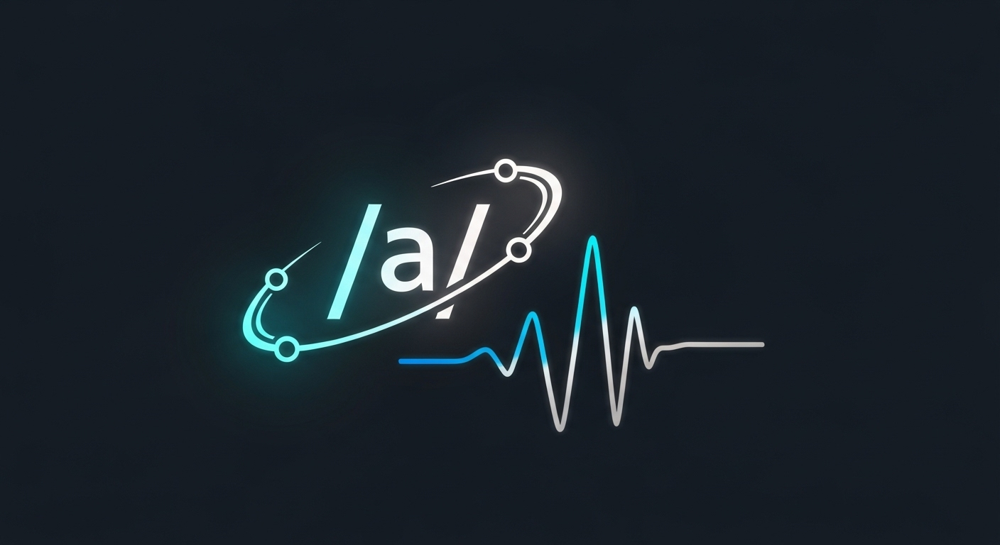

# Phonetic DialectGen TTS

<p align="center">
  
</p>

<p align="center">
  <a href="LICENSE"></a>
  <a href="https://www.python.org/"></a>
</p>

## 项目简介

**Phonetic DialectGen** 是一个基于深度学习的语音合成（TTS）项目，结合了语言学知识（IPA音标），实现了对多语言和多地区方言的通用语音生成。项目目前已支持普通话和粤语，并可扩展到其他语言和方言。

## 项目特点

- **IPA驱动**：核心文本处理和建模均基于国际音标（IPA），可泛化到任意语言和方言。
- **多语言/方言支持**：已实现普通话和粤语的高质量语音合成，具备扩展性。
- **灵活的文本到音频流程**：支持多种输入格式（拼音、粤拼等），自动转换为IPA。
- **可插拔声码器**：集成 BigVGAN 等高质量声码器，支持自定义模型权重。
- **易于训练和推理**：提供标准化训练脚本和推理接口，便于快速部署和二次开发。

## 快速开始

### 环境准备

```bash
conda create -n tts python=3.10
conda activate tts
pip install -r requirements.txt
```
### 数据准备

我们提供了一个示例数据集，包含普通话和粤语的音频和对应文本。你可以使用自己的数据集，只需确保格式符合要求。

### 训练模型

```bash
python train.py
```

### 合成语音

```bash
python synthesize.py
```

## 主要流程

1. **文本预处理**  
   输入文本（如中文、粤语），自动转换为 IPA 音标序列。
2. **文本编码**  
   使用自定义 Tokenizer，将 IPA 序列编码为模型可处理的 token。
3. **语音生成**  
   基于 GlowTTS 结构生成梅尔频谱。
4. **声码器合成**  
   使用 BigVGAN 等声码器将梅尔频谱转换为高质量音频。

## 目录结构

```
phonetic_dialectgen/
├── shuyu/              # 四川蜀语方言相关代码
├── IPA/                # 国际音标（IPA）相关代码
├── bigvgan22HZ/        # BigVGAN 声码器相关代码和权重
├── layers/             # 神经网络层实现
├── misc/               # 辅助脚本和资源
├── tokenizer.py        # 文本编码
├── model.py            # GlowTTS 主模型
├── config.py           # 模型配置
├── trainer.py          # 训练器
├── dataset.py          # 数据集处理
├── train.py            # 训练入口
├── synthesize.py       # 合成入口
├── utils.py            # 工具函数
├── requirements.txt    # 依赖包列表
```

## 效果展示

- 普通话效果
> “你好，欢迎使用通用语音合成系统。我们的模型基于国际音标构建，支持多种语言和方言。”

<audio controls>
  <source src="assets/1.wav" type="audio/wav">
</audio>

- 粤语效果
> “早唞！歡迎你嚟試下我哋嘅語音系統。依家我哋已經支援廣東話喇！”

<audio controls>
  <source src="assets/2.wav" type="audio/wav">
</audio>

- 四川话效果
> “伙计，今朝你吃了啥子没得？这个系统安逸得很咯！”

<audio controls>
  <source src="assets/3.wav" type="audio/wav">
</audio>

## 扩展与定制

- 支持自定义训练数据和方言
- 可替换声码器或模型结构
- 支持本地权重加载

## 适用场景

- 多语言语音合成
- 方言语音生成
- 语言学研究与语音数据增强
- 智能语音助手、播报系统等

## Acknowledgements
感谢以下开源项目和资源, 我们在此基础上进行了扩展和改进：
- [GlowTTS](https://github.com/jaywalnut310/glow-tts)
- [Coqui TTS](https://github.com/coqui-ai/TTS)
- [BigVGAN](https://huggingface.co/nvidia/bigvgan_v2_22khz_80band_256x)

## 联系与贡献

欢迎提交 issue 或 PR，交流语言学与 TTS 技术！

---

**Phonetic DialectGen** —— 用语言学知识驱动的通用语音合成平台。