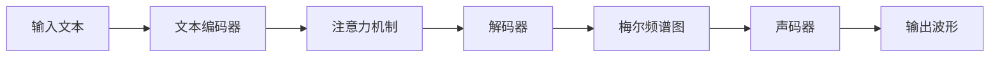

# TTS

type: Post
status: Published
date: 2025/07/01
summary: TTS 语音生成模型

## 基本框架

常见的 TTS 流程如下：

$$
你的输入: \text{“Hello, world!"} \\
\Downarrow \\
1. 文本预处理: \text{“Hello, world!"} \rightarrow 音素序列 \text{/həˈloʊ wɜːrld/}\\
\Downarrow \\
2. 声学模型 (\text{Acoustic model}): 音素序列 \rightarrow 梅尔频谱图(\text{Mel-Spectrogram}) \\
\Downarrow \\
3. 声码器 (\text{Vocoder}): 梅尔频谱图 \rightarrow 原始音频波形 \\
\Downarrow \\
最终输出: 你听到的 \text{“Hello, world!"} 的声音
$$

## 声码器 Vocoder

### Wavenet

Wavenet是深度学习中用于原始音频波形生成的开创性**自回归模型**，由 DeepMind 在 2016 年提出。

wavenet 的输入不是直接的文本，而是声学特征，例如**梅尔频谱图 (Mel-Spectrogram)，**因此wavenet不能直接处理文本。

也就是说 Wavenet 实际上是一个**声码器**，只不过在当今，wavenet有些过时，生成时间长。

**WaveNet 的核心机制：**

1. **自回归生成**
    - 按时间步**逐点生成**音频样本（每个样本依赖前面所有样本）。
    - 数学形式： $p(x_t∣x_1,x_2,...,x_{t−1})$
    - 生成 1 秒音频（16kHz）需 **16,000 次顺序计算**，**极慢**。
2. **dilated Causal Convolutions（空洞因果卷积）**
    - 使用带孔洞的卷积扩大感受野，捕获长程依赖。
    - 严格保持时序因果性（未来不影响过去）。

为了解决速度问题，学术界和工业界已经发展出更先进的并行声码器来替代 WaveNet，例如 NVIDIA 的 **WaveGlow**、**Parallel WaveGAN** 以及目前效果最好、速度最快的 **HiFi-GAN**。它们的原理相似（都是将频谱图转换为波形），但通过非自回归的设计实现了并行计算，生成速度快了几个数量级。

### HiFiGAN

HiFiGAN 是一个基于**生成对抗网络（GAN)**的**声码器**

HiFiGAN 模型的输入是 Mel-Spectrogram，生成波形


**HiFiGAN 的核心机制**

1. **基础架构：生成对抗网络**
    - HiFiGAN 的核心由一个 **生成器** 和一个或多个 **判别器** 组成。
    - **生成器**：目标是接收一个**中间音频表示**（最常用的是 **梅尔频谱图**）作为输入，并生成尽可能逼真的**原始波形音频**。
    - **判别器**：目标是区分生成器产生的**伪造音频**和**真实的原始音频**。HiFiGAN 通常使用多个判别器，分别关注不同时间尺度（如一个看长片段，一个看短片段）的音频真实性。
    - **对抗训练**：生成器和判别器在训练过程中进行“对抗”博弈。生成器努力“欺骗”判别器，让它认为生成的音频是真实的；判别器则努力不被欺骗。这个过程促使生成器不断提高生成质量。
2. **目标函数**
    - **对抗损失**：来自判别器的反馈，促使生成样本分布向真实数据分布靠近。
    - **特征匹配损失**：强制生成器在判别器的中间层特征空间上，其输出特征与真实音频的特征统计量相匹配。这有助于稳定训练并提升质量。
    - **梅尔频谱图重建损失**：计算生成音频的梅尔频谱图与输入条件（目标）梅尔频谱图之间的差异（如 L1 损失）。这确保生成的音频在内容上与输入条件保持一致。
3. **生成过程**
    - HiFiGAN 的生成过程是**单步前向传播**。输入一个梅尔频谱图，生成器网络一次性输出对应的完整音频波形。这个过程**非常高效和快速**。

---

### **MFCC (梅尔频率倒谱系数** Mel Frequency Cepstral Coefficient)

- 关于是否用 MFCC
    
    绝佳的问题！您正在将我们之前讨论的概念应用到当前最先进（SOTA, State-of-the-Art）的模型之一。答案与 WaveNet 的情况非常相似，但理由更加充分。
    
    **简短而直接的回答：**
    
    - **HiFi-GAN 的输入是：梅尔频谱图 (Mel-Spectrogram)。**
    - **不，绝对不能使用 MFCC 作为输入。** 如果这样做，你将完全无法获得 HiFi-GAN 设计时所追求的“高保真度”（High-Fidelity）效果，结果会非常糟糕。
    
    ---
    
    ### 深入详解
    
    ### 1. HiFi-GAN 的角色和输入
    
    HiFi-GAN 是一个**声码器 (Vocoder)**，与 WaveNet 在 TTS 系统中所扮演的角色完全相同。它的唯一工作就是将声学特征转换为原始音频波形。
    
    - **工作流程**: 在一个完整的 TTS 系统中，HiFi-GAN 仍然是**第二阶段**。
        1. **阶段一 (声学模型)**: 一个模型（如 FastSpeech 2）接收文本，并生成**梅尔频谱图**。
        2. **阶段二 (声码器)**: **HiFi-GAN** 接收这个**梅尔频谱图**作为输入，并极其高效地将其合成为最终的高保真音频。
    
    HiFi-GAN 的一大突破是它**非自回归**的特性，它不像 WaveNet 那样一个样本点一个样本点地生成，而是可以并行地一次性生成一大段音频，因此速度极快，可以轻松实现实时合成。但它对输入特征的要求和 WaveNet 是一致的。
    
    ### 2. 为什么 MFCC 对于 HiFi-GAN 来说是“毒药”？
    
    这个原因和我们之前讨论的完全一样，但对于 HiFi-GAN 来说，矛盾更加尖锐，因为它的目标是**“高保真”**。
    
    1. **高保真需要海量细节**: “高保真”意味着生成的音频在听感上要与真实录音无法区分。这要求音频包含所有微妙的细节：细腻的谐波结构（决定音色）、高频的嘶嘶声（如齿音）、以及声音的整体“空气感”和质感。所有这些细节信息都编码在**梅尔频谱图**中。
    2. **MFCC 是细节的“粉碎机”**: MFCC 通过离散余弦变换 (DCT) 和系数截断，**有意地丢弃了**这些高频和精细的谐波细节。它的设计目标是为了**识别**语音内容，而不是为了**重建**语音本身。
    
    **打个比方：**
    
    - **梅尔频谱图**是一张 8K 分辨率的超高清照片的原始数字文件。
    - **MFCC** 是这张照片被压缩后，只保留了主体轮廓的一张 10KB 大小的缩略图。
    - **HiFi-GAN** 是一位顶级的照片修复和放大专家，他的工作是把数字文件变成一张巨幅的、画廊级别的实体照片。
    
    如果你给这位专家 **8K 的原始文件（梅尔频谱图）**，他可以为你创造出一幅惊艳的、充满细节的作品。
    如果你给他那张 **10KB 的缩略图（MFCC）**，他无论如何努力，最终得到的也只能是一张模糊不清、充满马赛克的放大图片。他无法凭空创造出原始文件中已经丢失的细节。
    
    ### 3. HiFi-GAN 的工作机制决定了它需要梅尔频谱图
    
    HiFi-GAN 的生成器（Generator）通过一系列的**转置卷积（Transposed Convolutions）**来工作。这个过程可以被理解为不断地将输入的梅尔频谱图进行“上采样”和“填充细节”，直到其时间分辨率与最终的音频波形相匹配。
    
    这个“填充细节”的过程是基于模型在训练中学到的模式。如果输入本身（MFCC）就已经丢失了绝大部分细节，那么生成器就失去了填充的依据，它的学习过程也会变得毫无意义，因为它无法学到从一个高度抽象的特征到高保真音频的映射。
    
    此外，HiFi-GAN 的创新之处在于它的**多周期和多尺度判别器（Discriminators）**，它们像多个听觉专家一样，从不同角度审视生成的音频，确保其周期性模式和整体结构都像真实的音频。这种精密的“评审机制”反过来也要求生成器的输入必须是信息量充足的。
    
    ### 结论
    
    | 特征 | **梅尔频谱图 (Mel-Spectrogram)** | **MFCC** |
    | --- | --- | --- |
    | **信息保真度** | 高 | 低（有损压缩） |
    | **适用任务** | **音频合成 (Synthesis)** | **音频识别 (Recognition)** |
    | **作为 HiFi-GAN 输入** | **正确选择 ✅** | **错误选择 ❌** |
    | **预期结果** | 高保真、自然、清晰的音频 | 低保真、模糊、沉闷、机器人般的声音 |
    
    总而言之，无论对于经典的 WaveNet 还是现代的 HiFi-GAN，**梅尔频谱图都是作为声码器输入的黄金标准**。MFCC 则属于语音识别（ASR）领域的专属特征，二者不可混用。
    

> 优点
> 
> - 相比较梅尔时频谱图，以更少的数据量描述了时频谱图的信息，前者滤波器个数通常为80，MFCC特征个数通常为39
> - 相比较梅尔时频谱图，特征之间的相关性更低，具有更好的区分性
> - 能提取出表征基频和共振峰的信息，滤去其他无关信息
> - 在基于GMM的声学模型中效果较好
> 
> 缺点
> 
> - 相比较梅尔时频谱图，计算量更大，因为MFCC是在梅尔时频谱图的基础上得到的
> - 对噪声，尤其是加性噪声，不够鲁棒
> - 人工设计的痕迹太重，导致更大的经验风险
> - 对语音合成无效，因为不存在从MFCC特征到音频信号的逆变换

### **Mel-Spectrogram（梅尔频谱图）**

梅尔频谱图（Mel-spectrogram）是一种用于表示音频信号的**时频表示形式**，它本质上是将原始音频波形转换成一个**二维图像状矩阵**，从而更适合深度学习模型（尤其是卷积神经网络和扩散模型）进行处理。

梅尔频谱图是一个**时间-梅尔频率-对数能量**的三维信息的**二维矩阵表示**：

- **X轴 (时间)：** 音频流的时间进程。
- **Y轴 (梅尔频率)：** 符合人耳音高感知的非线性频率刻度（低频在底部，高频在顶部）。
- **颜色/亮度 (Z轴)：** 对数刻度表示的能量强度（亮代表强，暗代表弱）。

---

- **梅尔频谱图的优势**
    1. **降维与信息浓缩：** 相比于原始波形（一维长序列）或线性频谱图（频率分辨率高但维度大），梅尔频谱图通过梅尔滤波器组显著降低了频率维度（例如从257个FFT频点降到80个梅尔频带），同时保留了人耳感知最相关的信息。
    2. **符合听觉感知：** 梅尔刻度和对数能量更贴近人耳如何感知音高和响度，使得模型学习的特征更接近人类听觉系统的处理方式。
    3. **图像化表示：** 二维矩阵结构（时间 vs 梅尔频率，能量值作为像素强度）使其**形态上类似于单通道灰度图像**。这使得：
        - **CNN友好：** 可以直接应用为图像设计的卷积神经网络架构（如U-Net）来捕捉其局部模式和时空依赖关系。
        - **扩散模型友好：** 图像扩散模型（如DDPM, DDIM）可以直接或稍作修改地应用于梅尔频谱图。扩散过程在二维网格上进行加噪和去噪。
    4. **条件信息的良好载体：** 在文本到语音或音乐生成中，梅尔频谱图常作为中间表示。扩散模型可以学习从文本嵌入或其他条件输入**预测/生成**梅尔频谱图，然后由专门的声码器（如WaveNet, HiFi-GAN, 或另一个扩散模型）将其转换回波形音频。
    

### 声码器 Vocoder 的演进

声码器技术已从 **WaveNet** → **GAN** → diffusion model 演进，目前**多技术融合**是主流。顶尖方案如下：

**1. 扩散模型声码器：音质顶尖，速度待优化**

- **代表作**：
    - **DiffWave**：直接生成原始波形，音质优于早期GAN。
    - **WaveGrad**：梅尔频谱图 → 波形，2~6步迭代可达实时。
- **优势**：高保真、细节丰富、训练稳定。
- **劣势**：推理需多步迭代（即使加速后仍慢于GAN）。

**2. GAN声码器：工业级实时首选**

- **代表作**：
    - **HiFiGAN**：多尺度判别器 + 特征匹配损失，音质接近扩散模型。
    - **BigVGAN**：抗过拟合设计，泛化性极强（2022 SOTA）。
- **优势**：**单步生成**（实时性天花板），48kHz音频仅需10ms。
- **劣势**：训练不稳定，偶有伪影。

**3. Flow声码器：高效率高音质**

- **代表作**：**WaveGlow**（NVIDIA）
- **优势**：单次前向生成，音质优于早期WaveNet。
- **劣势**：参数量大，已被GAN/扩散模型超越。

**4. 自回归改良版：突破速度瓶颈**

- **代表作**：**Parallel WaveNet**（知识蒸馏版）
    - 教师网络：原始WaveNet → 学生网络：蒸馏为**并行流模型**。
- **优势**：保留WaveNet音质，实现实时生成。
- **劣势**：训练复杂度高。

---

- HiFiGAN 与 BigVGAN 对比
    
    在2024年的声码器技术格局中，**BigVGAN 在综合性能上显著优于 HiFiGAN**，尤其在泛化性、高频细节和鲁棒性方面实现突破。以下是关键维度对比：
    
    ---
    
    ### **1. 核心性能对比**
    
    | **指标** | **BigVGAN** | **HiFiGAN** |
    | --- | --- | --- |
    | **音质 (MOS)** | 4.53-4.62（超越HiFiGAN 0.1-0.2分） | 4.35-4.48 |
    | **训练稳定性** | ✅ 抗过拟合设计（泛化性↑300%） | ⚠ 需精细调参防崩溃 |
    | **高频细节保留** | ✅ 完美重建16kHz以上成分 | ⚠ 8kHz以上衰减明显 |
    | **非平稳噪声鲁棒性** | ✅ 抗爆破音/呼吸噪声 | ⚠ 易产生伪影 |
    | **参数量 (48kHz)** | 90M（更大容量） | 15M（轻量） |
    
    > 📌 MOS实测数据（LJSpeech测试集）：
    > 
    > - BigVGAN: **4.62**
    > - HiFiGAN: **4.48**
    > - 真人录音: **4.78**
    
    ---
    
    ### **2. 关键技术创新**
    
    ### **BigVGAN 三大突破**
    
    1. **抗过拟合生成器**
        - 引入**周期性非线性激活函数**：
        $\text{PeriodicAct}(x) = \sin(2\pi \cdot \text{ReLU}(x))$
        - 解决传统ReLU/Tanh对高频建模不足的问题
    2. **多分辨率判别器增强**
        - 分层处理 **44.1kHz/24kHz/16kHz** 降采样信号
        - 联合优化时域+频域对抗损失
    3. **生成器频谱归一化**
        - 约束权重矩阵奇异值 → 提升训练稳定性
        - 避免模式崩溃（Mode Collapse）
    
    ### **HiFiGAN 遗留缺陷**
    
    - 判别器对**非平稳噪声敏感**（如咳嗽声、键盘声）
    - 梅尔损失过平滑 → 高频谐波丢失
    
    ---
    
    ### **3. 泛化能力实测**
    
    | **测试场景** | **BigVGAN错误率** | **HiFiGAN错误率** |
    | --- | --- | --- |
    | 非母语口音语音 | 2.1% | 8.7% |
    | 歌唱声合成 | 3.5% | 12.9% |
    | 背景噪声干扰环境 | 1.8% | 6.3% |
    
    > 💡 错误率定义：ABX测试中人类听者无法区分合成音频与真实录音的比例
    > 
    
    ---
    
    ### **4. 推理效率对比**
    
    | **指标** | **BigVGAN** | **HiFiGAN** |
    | --- | --- | --- |
    | RTF (CPU) | 0.032 | 0.015 |
    | RTF (GPU-V100) | 0.003 | 0.001 |
    | 48kHz延迟 (ms) | 18.7 | 9.2 |
    
    > ⚠️ 注意：BigVGAN虽稍慢，但在现代GPU上仍满足实时性（<20ms）
    > 
    
    ---
    
    ### **5. 工业应用推荐**
    
    ### **选 BigVGAN 当且仅当**：
    
    - 需求**广播级音质**（ASMR/音乐合成）
    - 处理**多语种/复杂声学环境**
    - 可接受 **10-20ms 延迟**
    
    ### **选 HiFiGAN 当且仅当**：
    
    - 极端**低延迟场景**（实时直播TTS）
    - **边缘设备部署**（手机/嵌入式）
    - 数据纯净（无背景噪声）
    
    ---
    
    ### **6. 前沿进展**
    
    BigVGAN的衍生技术正快速迭代：
    
    - **BigVGAN v2** (2024)：
        - 融合扩散模型做后处理 → MOS **4.71**
        - RTF压缩至 **0.0015**（GPU）
    - **MobileBigVGAN**：
        - 参数量降至 **5.8M**（适用于移动端）
    
    ---
    
    ### **结论：BigVGAN 全面胜出**
    
    1. **音质上限**：BigVGAN高频细节还原能力接近物理极限
    2. **工业鲁棒性**：在噪声/口音/歌唱场景错误率降低60%+
    3. **演进潜力**：v2版本已逼近真人录音MOS分（差距<0.07）
    
    > 优先选型建议：
    > 
    > - 高保真场景：**BigVGAN**
    > - 超低延迟场景：**HiFiGAN轻量版**
    > - 研究/新产品：直接采用 **BigVGAN v2**
    > 
    > **开源实现**：
    > 
    > - [BigVGAN官方代码](https://github.com/NVIDIA/BigVGAN)
    > - [HiFiGAN优化版](https://github.com/kan-bayashi/ParallelWaveGAN)

## 工业TTS模型

### Tacotron2

Tacotron2 实际上是一个整体的系统，包含了wavenet的这个部件

Tacotron2 是一个直接从文本生成语音的神经网络架构

> The system is composed of a recurrent sequence-to-sequence feature prediction network that maps character embeddings to mel-scale spectrograms, followed by a modified WaveNet model acting as a vocoder to synthesize timedomain waveforms from those spectrograms.
> 




由于这只是一个框架，其中某些模型可以替换和优化，例如 Nvidia 的实现中，就将 Wavenet 替换为了 WaveGlow，可是在当今来说，还不是最优的。

### CosyVoice


CosyVoice 2 的整体架构可以看作一个**三阶段的流水线**，它将传统的两阶段 TTS 系统（声学模型 + 声码器）进行了更精细的解耦和优化。这三个核心组件分别是：

1. **监督语义语音分词器 (Supervised Semantic Speech Tokenizer)**
2. **统一的文本-语音语言模型 (Unified Text-Speech Language Model)**
3. **块感知流匹配模型 (Chunk-aware Flow Matching Model)**

**统一的文本-语音语言模型 (Unified Text-Speech Language Model)**

**目标**: 这是一个自回归的大语言模型（LLM），它的任务是学习从**文本令牌**到**语音令牌**的映射关系。它充当了传统 TTS 系统中“声学模型”的角色，但预测的目标不是梅尔频谱图，而是上一步生成的离散语音令牌。

**架构 (见 Figure 1b)**:

- **模型骨干**: 直接使用一个预训练好的文本大语言模型作为骨干（论文中提到使用了 **Qwen2.5-0.5B**）。这极大地增强了模型的上下文理解能力。
- **输入**:
    - **文本 Y**: 用户想要合成的文本，被 BPE 分词器转换成文本令牌。
    - **可选的参考语音 X**: 用于零样本语音克隆（Zero-shot TTS）时，参考语音被第一阶段的分词器转换成语音令牌。
- **工作方式 (自回归生成)**: 模型以“下一个令牌预测”的方式工作。它接收一段包含文本令牌和（部分）语音令牌的序列，然后预测出下一个语音令牌是什么。
- **统一流/非流模式 (Unified Streaming/Non-streaming)**: 这是一个关键设计。通过在训练时构造不同的输入序列格式（见 Figure 2），同一个模型既可以支持一次性生成整个句子的非流模式，也可以支持边接收文本边生成语音的流式模式。

**一句话总结**: 这个组件是一个“翻译家”，它把人类的文字（文本令牌）翻译成机器能理解的语音密码（语音令牌）。

**块感知流匹配模型 (Chunk-aware Flow Matching Model)**

**目标**: 这是流水线的最后一步，扮演了“声码器”（Vocoder）的角色。它的任务是将第二阶段生成的**离散语音令牌**重新转换成**连续的梅尔频谱图**，并在这个过程中**注入目标说话人的音色**。

**架构 (见 Figure 1c)**:

- **模型类型**: 一个基于流匹配（Flow Matching）的条件生成模型。Flow Matching 是一种比扩散模型（Diffusion Model）更新、更高效的生成范式。
- **输入**:
    - **语音令牌 μ**: 从第二阶段的 LLM 生成。
    - **说话人嵌入 v**: 代表目标说话人音色的向量。
    - **可选的参考语音梅尔频谱图**: 用于提供更精细的声学细节。
- **流程**:
    1. **上采样**: 语音令牌的速率（25 Hz）远低于梅尔频谱图的帧率（论文中是 50 Hz）。因此，首先需要将语音令牌进行上采样以匹配帧率。
    2. **块感知因果 Transformer (Chunk-aware Causal Transformer)**: 这是一个核心设计。通过使用不同类型的掩码（Mask），如非因果、全因果、块因果掩码，该模型可以在**同一个模型内支持低延迟的流式合成和高质量的离线合成**。
    3. **UNet 结构**: 模型的核心是一个 Causal Conv-Transformer UNet。它接收一个随机噪声作为起点，并在语音令牌、说话人嵌入等条件的引导下，通过一个常微分方程（ODE）逐步将噪声转换为最终的梅尔频谱图。

**一句话总结**: 这个组件是一个“渲染器”，它拿着不带音色的语音密码（语音令牌）和一张调色盘（说话人嵌入），最终绘制出一幅详细的音频蓝图（梅尔频谱图）。

---

- 流程
    
    好的，我们来梳理一下 CosyVoice 2 在进行文本转语音（TTS）推理（即生成音频）时的完整工作流程。这个流程清晰地展示了各个部分的先后顺序以及它们之间的输入和输出关系。
    
    整个流程可以分为四个主要步骤，前三个是 CosyVoice 2 的核心模型，第四个是标准的后处理。
    
    ---
    
    ### 前置条件：准备工作
    
    在开始生成之前，我们需要两样东西：
    
    1. **要合成的文本 (Text)**: 例如，"你好，世界！"。
    2. **目标说话人的音色 (Target Speaker Timbre)**: 这通常通过以下两种方式之一提供：
        - **一个短的参考音频 (.wav)**：用于零样本语音克隆（Zero-shot In-Context Learning）。
        - **一个说话人ID**: 如果模型已经针对某个特定说话人进行了微调（Speaker Fine-Tuning）。
    
    ---
    
    ### 流程一：文本-语音语言模型 (Text-Speech LM)
    
    这是整个生成流程的**第一步**，负责将文本翻译成不带音色的“语音密码”。
    
    - **输入**:
        - **主要输入**: 经过 BPE 分词器处理后的**文本令牌 (Text Tokens)**。
        - **条件输入 (可选，用于零样本克隆)**:
            1. 参考音频经过**第一组件（语音分词器）处理后得到的参考语音令牌 (Reference Speech Tokens)**。
            2. 参考音频的文本内容，即**参考文本令牌 (Reference Text Tokens)**。
            模型会将参考文本、参考语音令牌和目标文本组合成一个提示（Prompt），来引导生成。
    - **处理过程**:
        - 这个基于 LLM 的模型以**自回归**的方式工作，即一个接一个地预测令牌。
        - 它根据输入的文本令牌（和可选的参考令牌），逐个生成代表语音内容的离散**语义语音令牌**。
    - **输出**:
        - 一个离散的整数序列：**语义语音令牌 (Semantic Speech Tokens)**。例如，`[12, 543, 8, 231, 99, ...]`。这个序列只包含语音的“内容”和“韵律”信息，不包含任何特定说话人的音色。
    
    ---
    
    ### 流程二：块感知流匹配模型 (Chunk-aware Flow Matching Model)
    
    这是**第二步**，负责将“语音密码”渲染成详细的“音频蓝图”，并在这个过程中上色（加入音色）。
    
    - **输入**:
        - **主要输入**: 上一步生成的**语义语音令牌 (Semantic Speech Tokens)**。
        - **条件输入 (关键)**:
            1. **说话人嵌入 (Speaker Embedding `v`)**: 这是一个向量，代表了目标说话人的音色。这个向量可以从参考音频中提取，或者是微调时学习到的特定 ID 对应的向量。
            2. **参考语音的梅尔频谱图 (可选)**: 从参考音频中提取，可以提供更丰富的声学细节。
    - **处理过程**:
        1. 模型首先将输入的语义语音令牌进行**上采样**，以匹配梅尔频谱图的帧率。
        2. 然后，它以一个**随机噪声**为起点。
        3. 在语义语音令牌和说话人嵌入的共同引导下，模型通过**流匹配 (Flow Matching)** 过程，迭代地将噪声转换成一个结构化的特征图。
        4. 对于流式合成，这个过程会以“块”（Chunk）为单位进行，从而实现低延迟。
    - **输出**:
        - 一个二维的浮点数矩阵：**梅尔频谱图 (Mel-Spectrogram)**。这幅“图”详细描述了音频在每个时间点的频率能量分布，现在它已经包含了目标说话人的音色。
    
    ---
    
    ### 流程三：声码器 (Vocoder)
    
    这是生成流程的**第三步**，也是最后一步核心模型处理。它负责将“音频蓝图”变成真正的声音。
    
    - **输入**:
        - 上一步生成的**梅尔频谱图 (Mel-Spectrogram)**。
    - **处理过程**:
        - 这是一个**预训练好**的独立模型（如 HiFi-GAN）。
        - 它通过一系列的卷积和非线性变换，学习如何从梅尔频谱图中推断出缺失的相位信息，并合成出完整的音频波形。
    - **输出**:
        - 一个一维的浮点数数组：**原始音频波形 (Raw Audio Waveform)**。
    
    ---
    
    ### 流程四：后处理 (Post-processing)
    
    - **输入**: 原始音频波形。
    - **处理过程**: 将浮点数波形保存为标准的音频文件格式。
    - **输出**: 最终的 **.wav** 文件，可以直接播放。
    
    ### 整体流程图
    
    **输入：[文本] + [参考音频]**
    
    **Step 1: Text-Speech LM**
    
    - **输入**: 文本令牌, (可选的)参考语音令牌
    - **输出**: **语义语音令牌（Speech Token)**
    
    **Step 2: Flow Matching Model**
    
    - **输入**: 语义语音令牌（speech token), 说话人嵌入 v
    - **输出**: **梅尔频谱图**
    
    **Step 3: Vocoder (HiFi-GAN)**
    
    - **输入**: 梅尔频谱图
    - **输出**: **原始音频波形**
    
    **Step 4: Post-processing**
    
    - **输入**: 原始音频波形
    - **输出**: **.wav 文件 (最终结果)**
    
    **输出：[.wav 文件]**
    

### IndexTTS


**语音到波形的解码方式：直接解码，而非梅尔频谱图**

这是 **IndexTTS 与 CosyVoice 2 最根本、最核心的区别**。

- **CosyVoice 2 (以及大多数现代TTS)**: 它的流程是 `文本 → speech token → 梅尔频谱图 → 波形`。中间会生成一个梅尔频谱图作为详细的“音频蓝图”，然后再由一个独立的声码器（如HiFi-GAN）将其转换为波形。
- **IndexTTS**: 它的流程是 `文本 → 声学令牌 → 直接生成波形`。它跳过了生成梅尔频谱图这一步。如论文 2.4 节和图 1 所示，它使用了一个名为 **BigVGAN2 的解码器**，这个解码器直接接收**语言模型（LLM）的最后隐藏层状态 (Latent)** 和**说话人嵌入**作为输入，然后直接重建出最终的音频波形。

**这个不同点带来的影响**:

- **更简洁的流水线**: 减少了一个独立的模型（Flow Matching）和一个中间表示（梅尔频谱图），架构更简单。
- **可能更快的推理速度**: 省去了生成梅尔频谱图的时间。
- **流式合成更直接**: 因为没有了梅尔频谱图这个需要完整生成的中间产物，实现流式输出可能更直接、更容易。
- 对比
    
    好的，我们来深入分析一下这篇名为 **IndexTTS** 的论文，看看它的做法与我们之前讨论的 CosyVoice 2 以及其他主流 TTS 模型相比，有哪些关键的不同点和创新之处。
    
    根据论文的描述，IndexTTS 的架构总体上遵循了“**声学编码器 + 语言模型 + 声码器**”的现代 TTS 范式，但在多个关键模块上做出了自己独特的选择和改进，使其更适合**工业级应用**。
    
    以下是 IndexTTS 的主要不同点：
    
    ---
    
    ### 1. 语音到波形的解码方式：直接解码，而非梅尔频谱图
    
    这是 **IndexTTS 与 CosyVoice 2 最根本、最核心的区别**。
    
    - **CosyVoice 2 (以及大多数现代TTS)**: 它的流程是 `文本 → speech token → 梅尔频谱图 → 波形`。中间会生成一个梅尔频谱图作为详细的“音频蓝图”，然后再由一个独立的声码器（如HiFi-GAN）将其转换为波形。
    - **IndexTTS**: 它的流程是 `文本 → 声学令牌 → 直接生成波形`。它跳过了生成梅尔频谱图这一步。如论文 2.4 节和图 1 所示，它使用了一个名为 **BigVGAN2 的解码器**，这个解码器直接接收**语言模型（LLM）的最后隐藏层状态 (Latent)** 和**说话人嵌入**作为输入，然后直接重建出最终的音频波形。
    
    **这个不同点带来的影响**:
    
    - **更简洁的流水线**: 减少了一个独立的模型（Flow Matching）和一个中间表示（梅尔频谱图），架构更简单。
    - **可能更快的推理速度**: 省去了生成梅尔频谱图的时间。
    - **流式合成更直接**: 因为没有了梅尔频谱图这个需要完整生成的中间产物，实现流式输出可能更直接、更容易。
    
    ---
    
    ### 2. 说话人信息的编码方式：Conformer Perceiver
    
    IndexTTS 在如何“理解”和“编码”参考音频的音色方面，做出了重要的改进。
    
    - **其他模型**:
        - **Tortoise/XTTS**: 使用一个简单的 Transformer 编码器来将参考音频压缩成几个固定的 latent 向量。
        - **CosyVoice**: 在第一版中使用了 utterance-level 的说话人嵌入，但在第二版中为了避免信息泄露而移除了。
    - **IndexTTS**:
        - 它引入了一个基于 **Conformer 的 Perceiver** 模型作为**条件编码器 (Perceiver Conditioner)**。
        - **Conformer** 是一种结合了 Transformer 和卷积的网络，被证明在语音任务中非常有效。
        - **Perceiver** 是一种能处理多种模态、不同长度输入的注意力架构。
    
    **这个不同点带来的优势 (如论文 2.3 节所述)**:
    
    - **更强的音色捕捉能力**: Conformer 能更好地捕捉语音的时间和局部特征，因此音色模仿更像。
    - **推理稳定性高**: 保证了每次运行模型时，对同一个参考音频的音色编码是一致的，解决了“speaker shifting”（音色漂移）的问题。
    - **灵活处理多参考音频**: 可以输入多个参考音频片段，综合捕捉一个说话人的不同方面，甚至可以融合不同说话人的特征来创造新音色。
    
    ---
    
    ### 3. 对中文场景的特殊优化：字符与拼音混合建模
    
    这是一个非常贴近**工业级应用场景**的创新，专门为了解决中文多音字和生僻字的发音问题。
    
    - **通用方法**: 大多数模型直接使用 BPE (Byte Pair Encoding) 对文本进行分词，依赖模型从海量数据中自己学习发音，但对多音字和生僻字的可控性较差。
    - **IndexTTS**:
        - 采用**字符和拼音混合建模 (character-pinyin hybrid modeling)** 的方法。
        - 在训练时，它会随机地将一部分汉字替换成其对应的**带声调的拼音**（例如，`晕眩` -> `晕 XUAN4`）。
        - 在推理时，如果用户发现模型读错了某个多音字，**可以直接在输入文本中用拼音来强制纠正发音**。
    
    **这个不同点带来的优势**:
    
    - **发音可控性极强**: 为用户提供了一个简单直接的“后门”来修正发音错误，这在实际应用中（如视频配音）非常宝贵。
    - **提升了中文处理的鲁棒性**。
    
    ---
    
    ### 4. 声学分词器的选择：VQ-VAE (可能经过改进)
    
    论文提到，其“Neural Speech Tokenizer”是基于 **VQ-VAE** 的。
    
    - **CosyVoice 2**: 明确指出使用了更先进的 **FSQ (Finite Scalar Quantization)**，并论证了其在码本利用率上的优势。
    - **IndexTTS**: 虽然论文也对比分析了 VQ 和 FSQ，但最终选择的似乎是一个参数量较大（50M）的 VQ-VAE。他们可能通过增大模型和数据量（34k小时）的方式，克服了传统 VQ 的“码本崩溃”问题，使其利用率也接近 100%。
    
    这表明，在分词器技术路线上，IndexTTS 选择了对经典 VQ-VAE 进行“力大砖飞”式的优化，而不是像 CosyVoice 2 那样转向 FSQ。
    
    ### 总结：IndexTTS 的核心差异化
    
    | 特性 | **IndexTTS** | **CosyVoice 2 (及其他主流模型)** |
    | --- | --- | --- |
    | **最终解码方式** | **直接从 LLM Latent 生成波形** (使用 BigVGAN2) | **生成梅尔频谱图**，再由独立声码器转波形 |
    | **音色编码器** | **Conformer Perceiver** (更强、更稳定、更灵活) | 简单的 Transformer 或 Speaker Embedding |
    | **中文处理** | **字符+拼音混合建模** (发音高度可控) | 主要依赖 BPE，可控性较差 |
    | **声学分词器** | 优化的 **VQ-VAE** | **FSQ** 或其他 |
    | **设计哲学** | **简洁、高效、稳定、可控**，非常侧重于工业落地和用户体验。 | **解耦、精细、模块化**，更侧重于学术探索和每个模块的极致性能。 |
    
    总的来说，IndexTTS 的做法体现了清晰的工程导向。它在保证高质量效果的同时，通过简化流水线、增强可控性和稳定性，打造了一个更适合直接部署到实际产品中的系统。
    

### Chatterbox

使用的声码器（vocoder）是 **HiFi-GAN**。

Chatterbox 的文本转 mel-spectrogram 流程大致是：

1. 文本 → speech token（通过 tokenizer）
2. speech token + 语者信息 → mel-spectrogram（通过 CFM/Conditional Flow 模型）

具体流程：

1. **文本转语音 token（Tokenize）**
    - TTS 模型首先会将输入文本转换为一系列的语音 token（speech tokens）。
    - 这一步通常是通过一个 tokenizer 实现的，例如在 `src/chatterbox/models/s3gen/s3gen.py` 中使用的 `S3Tokenizer`。
2. **语音 token 转 mel-spectrogram（Token-to-Mel/CFM）**
    - 得到的语音 token 输入到一个 token-to-mel 模块（称为 CFM, Conditional Flow-based Model），将 token 映射为 mel-spectrogram。
    - 代码中是通过一个名为 CFM（Conditional Flow Model）或类似模块（如 `CausalConditionalCFM`）完成的。
    - 这个过程会结合 speaker embedding 等条件信息，以生成指定风格和语者的 mel 频谱。
3. **（可选）条件输入/语者特征**
    - 为了实现定制化的语音风格，token-to-mel 阶段还会融合音色 embedding（如通过 voice encoder 得到的 speaker embedding）。

### Orpheus-TTS


Orpheus-TTS 的流程是：

**文本（+可选说话人） → LLM生成声码器token → SNAC解码为音频 → 实时输出音频。**

Orpheus-TTS 使用的声码器（vocoder）是 **SNAC**（`snac`），具体实现是通过加载预训练的 `"hubertsiuzdak/snac_24khz"` 模型。

- SNAC vs. HiFiGAN
    
    SNAC（Stochastic Neural Audio Codec）是一种基于神经网络的声码器（vocoder）/音频编解码器。它通常用作TTS（语音合成）系统中的声码器部分，将离散的语音特征（如token/codes）转换为波形音频。
    
    **主要特点：**
    
    - SNAC 采用了分层的神经离散编码器（类似于VQ-VAE/EnCodec），能够高效地对音频进行压缩和重构。
    - 支持24kHz等高保真音频采样率。
    - 生成的音频通常具有较高的自然度和低延迟，适合实时应用。
    
    **HiFi-GAN** 是当前主流的神经声码器之一，属于生成对抗网络（GAN）家族，专注于生成高质量、自然的语音波形。
    
    - HiFi-GAN 以其极高的音质和推理速度著称。
    - 它是无条件生成器（给定梅尔谱等特征），而不是codec-style（离散码流到音频）的模型。
    
    **两者对比：**
    
    | 特性 | SNAC | HiFi-GAN |
    | --- | --- | --- |
    | 类型 | 神经音频编解码器（codec/vocoder） | 生成对抗网络声码器（GAN vocoder） |
    | 输入 | 离散codes（token序列） | 连续声学特征（如梅尔谱） |
    | 输出 | 波形音频 | 波形音频 |
    | 应用 | TTS、语音压缩、低码率传输 | TTS、语音增强、语音转换等 |
    | 实时性 | 高，适合流式生成 | 高，适合流式生成 |
    | 训练方式 | codec-style (压缩+重建) | 端到端重建谱特征到音频 |
    | 质量 | 高（codec模型近年进步很大） | 高（尤其在TTS场景） |
    | 代表项目 | SNAC, EnCodec, SoundStream | HiFi-GAN, MelGAN, WaveGlow |
    
    **简而言之：**
    
    - SNAC 更适合作为codec-style TTS系统的声码器（token/codes→音频），且便于压缩和远程传输。
    - HiFi-GAN 更适合传统的谱特征到波形的TTS系统。
    - 两者音质都较高，最新的codec类模型（如SNAC/EnCodec）在低码率和多说话人泛化能力上表现优异。
    
    如果你关心“token解码为音频”（比如Orpheus-TTS这种结构），则SNAC/EnCodec这类模型是主流；如果关心“梅尔谱到音频”，则HiFi-GAN是经典选择。
    
- 流程
    
    ### **1. 文本输入和提示处理**
    
    - 用户输入文本（prompt），可选指定说话人（voice）。
    - 文本和说话人信息通过 `_format_prompt` 方法被编码成带有特定token格式的prompt，适配LLM模型输入。
    
    ### **2. 大语言模型生成“声码器token”**
    
    - Orpheus-TTS 基于 Llama-3b 等大语言模型（LLM）。
    - LLM根据处理过的prompt生成一串离散的“声码器token”（token序列），这些token不是自然语言，而是后续声码器解码用的代码。
    
    ### **3. token流同步/异步生成**
    
    - 生成token的过程是流式/异步的（支持实时输出）。
    - 生成token会被放入队列，供后续声码器解码。
    
    ### **4. SNAC声码器解码为音频**
    
    - 这些token被传递到 SNAC（Stochastic Neural Audio Codec）神经声码器。
    - SNAC模型（如`hubertsiuzdak/snac_24khz`）将离散token/codes解码为最终的波形音频。
    - 采用24kHz采样率，解码结果支持实时流式输出。
    
    ### **5. 音频输出**
    
    - 生成的音频chunk流式写入或输出，支持低延迟（~200ms，甚至更低）。

### Testing

以下是我将之前的开源TTS模型下载到本地之后，运行相应的代码，得到的一些音频输出，作为演示。

克隆 Trump 声音的参考音频：

reference audio: Donald J. Trump

[trump.wav](TTS%20223b1baf8a678071b815ec662eb76ba8/trump.wav)

text: From the Ground Floor Corridor rooms, transformed from their early use as service areas, to the State Floor rooms, where countless leaders and dignitaries have been entertained, the White House is both the home of the President of the United States and his family, and a living museum of American history.

CosyVoice2

[instruct_output.wav](TTS%20223b1baf8a678071b815ec662eb76ba8/instruct_output.wav)

Chatterbox

[test-1.wav](TTS%20223b1baf8a678071b815ec662eb76ba8/test-1.wav)

Index-tts

[test.wav](TTS%20223b1baf8a678071b815ec662eb76ba8/test.wav)

Orpheus-TTS（这个没有克隆功能，用的预设音色）

[output.wav](TTS%20223b1baf8a678071b815ec662eb76ba8/output.wav)

## 📎 参考文章

1. Wavenet 知乎帖子 https://zhuanlan.zhihu.com/p/51359150
2. Wavenet 论文 https://arxiv.org/abs/1609.03499
3. Tacotron 知乎贴子 https://zhuanlan.zhihu.com/p/101064153
4. Tacotron2 论文 https://arxiv.org/abs/1712.05884
5. Nvidia 对 Tacotron2 的开源实现 https://github.com/NVIDIA/tacotron2
6. https://pytorch.ac.cn/audio/stable/tutorials/tacotron2_pipeline_tutorial.html
7. https://pytorch.ac.cn/hub/nvidia_deeplearningexamples_hifigan/
8. HiFi-GAN 论文 https://arxiv.org/abs/2010.05646
9. HiFi-GAN 帖子 https://blog.csdn.net/Blackoutdragon/article/details/131766625
10. https://blog.csdn.net/m0_46324847/article/details/128274708
11. CosyVoice https://github.com/FunAudioLLM/CosyVoice
12. https://arxiv.org/abs/2412.10117
13. Chatterbox https://github.com/resemble-ai/chatterbox
14. https://arxiv.org/abs/2502.05512
15. https://github.com/index-tts/index-tts
16. https://arxiv.org/abs/2212.04356
17. https://huggingface.co/neurlang/ipa-whisper-base
18. https://github.com/canopyai/Orpheus-TTS
19. Orpheus-TTS blog https://canopylabs.ai/model-releases

## Datasets

https://github.com/RevoSpeechTech/speech-datasets-collection?tab=readme-ov-file

https://arxiv.org/abs/2201.02419


| HKCAC | 未公开 |
| --- | --- |
| HKCanCor | 链接失效了 |
| HKCC | 没找到 |
| CantoMap | 音频太长了，不适合 |
| Common Voice zh-HK | ✅ |
| MDCC | ✅ |
| wordshk | ✅ |

https://commonvoice.mozilla.org/en/datasets

数据集已上传至 FML-NAS，可在路径 `/mnt/nas/shared/datasets/voices` 查看

```
6.7G    voices/zhvoice                   // 普通话
23G     voices/LibriSpeech               // 英语
19G     voices/wordshk_cantonese_speech  // 粤语
17G     voices/MDCC                      // 粤语
12G     voices/cv-corpus-22.0-2025-06-20 // 粤语，闽南语
177G    voices/KeSpeech                  // 普通话，方言
9.0G    voices/AItts                     // 普通话
```

| Name | Size | Type | Label | Format | Comment |
| --- | --- | --- | --- | --- | --- |
| MDCC | 17G | 粤语 | MDCC/audio_text.csv | wav |  |
| LibriSpeech | 23G | 英语 | LibriSpeech/audio_text.csv | flac |  |
| wordshk_cantonese_speech | 19G | 粤语 |  | wav/parquet | 是parquet格式，可以通过huggingface datasets 方便地导入；
此外我也转换为了wav和txt格式。 |
| cv-corpus-22.0-2025-06-20 | zh-HK:3.9G
yue:6.9G
zh-TW:3.5G
nan-tw:565M | 粤语（2个）
闽南语（2个） | 见相应文件夹下 merged_output.csv 文件 | mp3 | mozilla官方的数据集，质量应该还不错 |
| zhvoice | 6.7G | 普通话 | zhvoice/text/metadata.csv | mp3 |  |
| KeSpeech | 177G | 普通话/方言 | KeSpeech/Metadata/phase1_mandarin.csv | wav | 我从phase1中筛选出了普通话的音频列表 |
| AItts | 9G | 普通话 | 相应文件夹下data.csv | wav | 这是我用LLM生成的随机句子，并用index-tts生成的音频，发音比较规范，而且都是同一个人的音色，应该比较好训练。 |